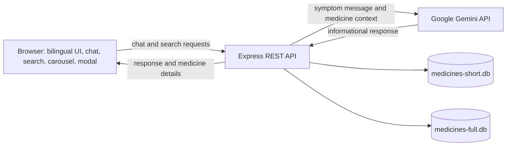
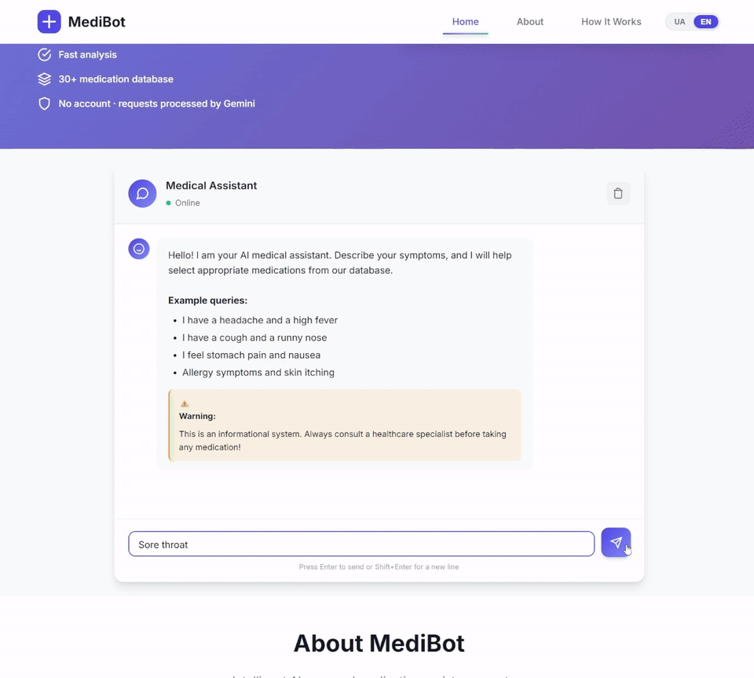

# MediBot — AI-Powered Medicine Information Chatbot

MediBot is a Bachelor's qualification project in Computer Science (2026). It demonstrates a bilingual web chatbot that sends a user's symptom description to Google Gemini, matches the response against a local SQLite medicine dataset, and presents informational results in a chat interface with a medicine carousel and detail modal.

## Tech Stack

- Frontend: HTML, CSS and vanilla JavaScript
- Backend: Node.js 18+, Express
- AI: Google Gemini through `@google/genai` (`gemini-3.5-flash` by default)
- Data: two SQLite databases initialized by `npm run init-db`

## Key Features

- Ukrainian and English interface with client-side language switching
- Symptom descriptions processed by Gemini and matched to local medicine entries
- Medicine search, carousel cards and detail modal
- Responsive layout and keyboard-accessible chat and modal controls
- No account required; chat history stays in the browser session and is not stored by this server

## Architecture



## Demo

The GIF shows a locally simulated `Sore throat` response, medicine carousel and detail modal. It is a prepared demo flow and does not represent a live Gemini response.



## Installation

Requirements: Node.js 18 or newer and npm. A Gemini API key can be created in [Google AI Studio](https://aistudio.google.com/app/apikey).

```bash
git clone https://github.com/ozzy404/medical-chatbot.git
cd medical-chatbot
npm ci
```

Create `.env` from the example.

PowerShell:

```powershell
Copy-Item .env.example .env
```

macOS/Linux:

```bash
cp .env.example .env
```

Set `GEMINI_API_KEY` in `.env`, then initialize the databases and start the application:

```bash
npm run init-db
npm start
```

Open <http://localhost:3000>. For development with automatic reload, run `npm run dev`.

## API

| Method | Endpoint | Description |
| --- | --- | --- |
| `POST` | `/api/chat` | Accepts `{ "message": "...", "language": "uk" }` (`uk` or `en`); returns an informational response and matched medicine records. |
| `GET` | `/api/medicine/:id` | Returns a medicine record. Use `?lang=en` for English fields. |
| `GET` | `/api/search?query=fever&lang=en` | Searches medicine names, categories and symptom fields. |
| `GET` | `/api/health` | Returns server status and timestamp. |

Chat messages must contain 1–4000 characters. The chat endpoint has a moderate per-IP request limit.

## Data & Limitations

The bundled medicine dataset is for educational/demo use and has not been clinically validated. Its descriptions, dosage information, contraindications, side effects and prices may be incomplete or outdated. Gemini output may also be inaccurate. The application does not establish diagnoses or determine whether a medicine is appropriate for an individual.

Chat messages are sent to the Google Gemini API for processing. This server does not persist chat history. Avoid entering identifying or sensitive personal information.

## Medical Disclaimer

MediBot is an educational project and is not intended for clinical use. Its content is informational only and is not medical advice, diagnosis or treatment. Consult a qualified healthcare professional before making decisions about medicines; seek urgent care for emergencies.

## License

This project is distributed under the [MIT License](LICENSE).
